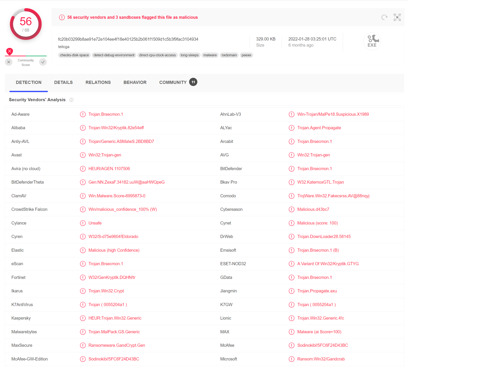
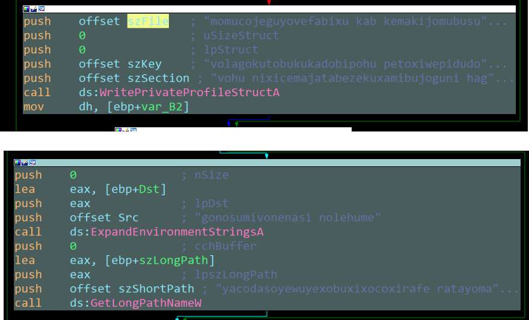
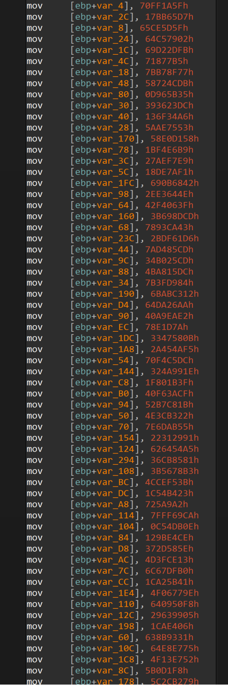
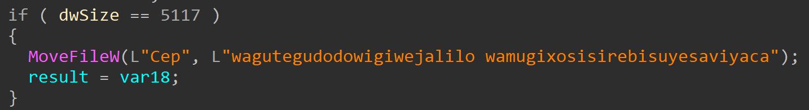
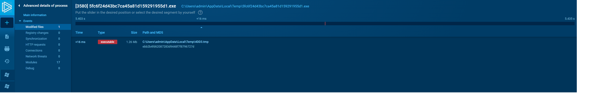

# Malware Analyst Internship Task

## File Identification

- Name: 5fc6f24d43bc7ca45a81d159291955d1
- Size: 329KB
- Type: PE32 EXE (GUI)
- Hashes:
  - MD5: 5fc6f24d43bc7ca45a81d159291955d1
  - SHA-1: 72fc3ce96bd9406215cec015d70bbb67318f1e23
  - SHA-256: fc20b03299b8ae91e72e104ee4f18e40125b2b061f1509d1c5b3f9fac310493
  - Imphash: 96d0079f67bae2a84dc8552c3ab1d176
  - SSDEEP: 6144:8OZsdXcUIAoUKjiXeZtna8UtDpiyeMTHSN+5qm:8OZQXcDkLuTa8UtteCHP
- Findings on VirusTotal:
  - 56/68 Detections in total
  - Malware Type: Trojan
  - Other Threat Names: Teitcga, SmokeLoader

## File Charactaristics

- Defensive:
  - Contains Debugging Traps:
    - INT 3 [C Runtime]
    - INT 29 "RTL Fast Fail" [C Runtime]
    - QueryPerformanceCounter [C Runtime]
    - GetTickCount [Exists Not Used]
  - Modules Loaded:
    - Kernel32:
      - CreateToolHelp32Snapshot
      - Module32FirstW
  - Creates a Hidden Window [Not Executed]:
    - `FillConsoleOutputCharacter`
- Artifacts:
    - Strings Found Used For Editing Environment Variables [Not Executed]:
      - `"gonosumivonenasi nolehume"` as the name of the variable
      - `"yacodasoyewuyexobuxixocoxirafe ratayomayatucocosububofomipaki lejusoxaxenekupewolosodulo vin"` as the path of the variable
      - Indicating There's a certain file that's essential being dumped/created at this path
      - 
- Heap Allocation:
    - LocalAlloc: Allocation of pages that are then occuppied at `sub_403206` with an array of 32bit hexadecimal values with size 180 
    - 
    - VirtualProtect: Modifying Permissions on the allocated pages with an flNewProtect value of 0x40, which is a flag named PAGE_EXECUTE_READWRITE enabling execution, read-only or read/write access to the occupied pages
- File Manipulation:
    - MoveFileW [Not Executed]:
      - moves a file named `"Cep"` to a path `"wagutegudodowigiwejalilo wamugixosisirebisuyesaviyaca"`
      - 
- OS Version Check [Not Executed]:
    - Although this method has no effect since the program is hard coded to provide dwTypeMask and dwConditionMask of 0x00 which will produce an error but it's worth mentioning

## File Behavior

- While Debugging i found multiple modules being stored at runtime
- at this point 2 threads were opened with the name `76F40D90`
- No Network activity, whilst i found a set very interesting entries in procmon logs:
  - it contains file creation and manipulation on /Local/Temp Directory associated with a file named 4DD3.tmp
  - at first i thought this file was generic to installation as i saw the date on it was no where near the current date
  - then i thought to run the file on any.run and guess what, it shows up as an IOC as a dropped file from the process with a severity level of `Danger`
  - it also checks supported languages from registry `"HKEY_LOCAL_MACHINE\SYSTEM\CONTROLSET001\CONTROL\NLS\SORTING\VERSIONS"`
  - overall 4DD3.tmp seems suspicious enough to continue from there
  - noticed also the process does manipulation on the dropped file after being dropped either loads or rewrites it

- after digging on this temp file:
  - File Identification:
    - Name: 4DD3.tmp
    - Location: %USER_TEMP%
    - Hashes:
      - MD5: ebb2b4fd62087283d9448f7f8796727d
      - SHA-1: bac1def600251b45a19530d0867d7c1d09932d32
      - SHA-256: 9c9ea64c0d56bf17d388c58b36ab7a79ca6aa74446b6dd2f614f5cbf9d828529

  - it's a PE32 (DLL) File that is supposed to be ntdll.dll
  - and i found an article published by trend micro that describes charactaristics and how to deal with `SmokeLoader Trojan` which is actually the other threat name for our sample here, and the article contains in the steps to delete this exact file `%USER_TEMP%\4DD3.tmp` <- `Copy of %SYSTEM%\NtDll.dll`
  - through the article i found that the malware family checks for VMs and terminates itself via two registry keys:
    - `HKLM\System\CurrentControlSet\Enum\SCSI`
    - `HKLM\System\CurrentControlSet\Enum\IDE`
    - which matched our procmon results of 8 entries on SCSI and 2 entries on IDE
  - the malware family is supposed to drop xml file and a component from the C2 server that it should've communicated with, but in our case there was no network activity meaning the sample was modified to not contact a c2 server nor activate the payload

## Conclusion

- Based on the evidence collected, we can identify that this trojan does process injection with the intent to steal information that is associated with processes using ntdll.dll module and allegedly send them back to the C2 server 
- A Malware That contains many red flags but is not effective in exfiltration

## Resources
- [VirusTotal](https://www.virustotal.com/gui/file/fc20b03299b8ae91e72e104ee4f18e40125b2b061f1509d1c5b3f9fac3104934/)
- [ANY.RUN](https://app.any.run/tasks/d62ad128-2316-43ad-b99d-e84ddeb086e1/)
- [SMKLDR Trend Micro Aritcle](https://www.trendmicro.com/vinfo/us/threat-encyclopedia/malware/trojan.win32.smokeloader.ai/)
- [Procmon Results](./ProcmonResults.CSV)